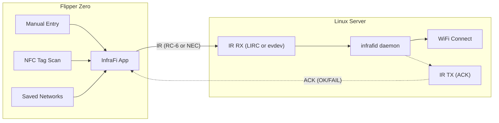

# InfraFi

Transmit WiFi credentials from a **Flipper Zero** to a **Linux server** using infrared. Point, press Send, connected.

Built for headless servers (NAS boxes, Intel NUCs, etc.) where typing WiFi passwords is painful or impossible.

## How It Works



The Flipper encodes WiFi credentials as a sequence of **IR messages** (RC-6 or NEC) and blasts them at the server's IR receiver. The `infrafid` daemon decodes the transmission and connects to the network automatically. No pairing, no Bluetooth, no network required — just line-of-sight IR.

With **ACK enabled**, the daemon transmits a response back via IR — the Flipper displays whether the connection succeeded (with IP address) or failed.

## Features

### Flipper Zero App
- **Manual entry** — On-screen keyboard for SSID and password, security type selector (Open/WPA/WEP/SAE)
- **NFC WiFi tags** — Scan an NTAG213/215/216 tag with WiFi credentials (standard NDEF WiFi Simple Configuration format) and transmit instantly
- **Saved networks** — Credentials auto-save to SD card after successful transmit. Browse, resend, or delete saved networks
- **IR protocol selection** — Choose between RC-6 (36kHz, for CIR receivers like ITE8708) or NEC (38kHz, for devices like the Squeezebox Touch) in Settings
- **Fast transmission** — Full credentials sent in under a second via RC-6, or a few seconds via NEC
- **Hidden network support** — Toggle hidden SSID flag
- **ACK feedback** — Optional. When enabled in Settings, the Flipper waits for a response from the server after sending credentials. Shows "Connected! IP: x.x.x.x" or "Failed" on screen

### Linux Daemon (`infrafid`)
- **Zero dependencies** — Pure C, no Python or runtime libraries needed
- **Automatic WiFi connection** — Detects NetworkManager, systemd-networkd, or ifupdown and connects appropriately
- **Rollback on failure** — Saves current SSID before connecting; reconnects to previous network if the new one fails
- **SSID verification** — After WPA handshake completes, verifies the connected SSID matches the target to avoid false positives
- **IR ACK response** — Sends connection result back to the Flipper via IR (requires TX hardware or external IR blaster)
- **Runs as a service** — systemd unit with auto-restart, logs to journald/syslog
- **Dual protocol** — LIRC input accepts both RC-6 and NEC scancodes automatically (just enable the protocol in `/sys/class/rc/rc*/protocols`)
- **ITE8708 optimized** — Uses `LIRC_MODE_SCANCODE` for kernel-decoded scancodes, avoiding hardware FIFO overflow issues with the CIR receivers found in Intel NUCs
- **evdev fallback** — For devices without LIRC (e.g., Squeezebox Touch), read NEC scancodes from `/dev/input/eventN` via `--evdev` (expects FAB4-style bit ordering)

## Getting Started

### Requirements

**Flipper Zero:**
- Flipper Zero with up-to-date firmware
- [ufbt](https://github.com/flipperdevices/flipperzero-ufbt) (Flipper build tool)

**Linux Server:**
- IR receiver — tested with:
  - ITE8708 CIR in Intel NUCs (`/dev/lirc0`, RC-6 or NEC via LIRC)
  - Squeezebox Touch FAB4 IR (`/dev/input/event1`, NEC via evdev)
- `gcc` and Linux headers for building
- NetworkManager, systemd-networkd, or ifupdown + wpa_supplicant for WiFi management

### Build & Install — Flipper App

```bash
# Clone the repo
git clone https://github.com/amd989/infrafi.git
cd infrafi

# Build
ufbt

# Deploy to Flipper (connected via USB)
ufbt launch
```

### Build & Install — Linux Daemon

```bash
cd daemon

# Quick install (builds, installs, configures RC-6, starts service)
sudo ./install.sh

# Or manually:
make
sudo make install
sudo systemctl enable --now infrafid
```

The install script automatically:
- Configures the IR receiver for RC-6 and NEC protocols
- Creates a udev rule so the config persists across reboots
- Installs and starts the systemd service

### Pre-built Packages

Debian/Ubuntu and RPM packages are available from [GitHub Releases](https://github.com/amd989/infrafi/releases) for amd64, arm64, armhf, and armel (ARMv6, Raspberry Pi Zero/1) architectures.

**APT repository:**
```bash
curl -fsSL https://amd989.github.io/InfraFi/install-apt.sh | sudo bash
sudo apt install infrafid
```

**YUM repository:**
```bash
curl -fsSL https://amd989.github.io/InfraFi/install-yum.sh | sudo bash
sudo yum install infrafid
```

### Verify IR Receiver

```bash
# Check that rc-6 is the active protocol
cat /sys/class/rc/rc0/protocols
# Should show: ... [rc-6] ...

# Test reception (Ctrl+C to stop)
ir-keytable -t -s rc0
```

## Usage

### Manual Entry
1. Open **InfraFi** on your Flipper
2. Select **Send Credentials**
3. Enter SSID, password, and security type
4. Review on the confirm screen, press **Send**
5. Point the Flipper at the server's IR receiver

### NFC Tag
1. Write WiFi credentials to an NTAG213/215/216 using a phone app (e.g., **NFC Tools**)
2. Open **InfraFi** → **Scan NFC Tag**
3. Hold the tag to the back of the Flipper
4. Review credentials, press **Send**

### Saved Networks
1. Previously transmitted networks are auto-saved to the SD card
2. Open **InfraFi** → **Saved** to browse them
3. Select a network to resend

### IR Protocol
1. Open **InfraFi** → **Settings** → set **IR Protocol** to **RC-6** (default) or **NEC**
2. Use **RC-6** for CIR hardware designed for media center remotes (Intel NUCs)
3. Use **NEC** for devices with NEC-based IR receivers (Squeezebox Touch, many consumer devices)

> **Note:** On the daemon side, LIRC accepts both RC-6 and NEC automatically — no flag changes needed, just ensure the protocol is enabled in `/sys/class/rc/rc*/protocols`. The `--evdev` flag is only needed for devices that don't have LIRC (like the Squeezebox Touch).

### ACK (Bidirectional Feedback)
1. Open **InfraFi** → **Settings** → set **Wait for ACK** to **On**
2. Send credentials as usual
3. After transmitting, the Flipper shows "Waiting for server response..." with a cyan LED
4. The daemon connects to WiFi and transmits the result back via IR:
   - **Connected!** — green LED, shows IP address
   - **Failed** — red LED
   - **No response** — times out after 30 seconds (credentials were still sent)

> **Note:** ACK requires an IR transmitter on the server side. Many NUCs have a CIR receiver but no TX LED. Use `--ack-device` with an external USB IR blaster if needed.

### Daemon

```bash
# Run in foreground with verbose logging (useful for testing)
sudo infrafid -f -v

# Use an evdev device for NEC reception (e.g., Squeezebox Touch)
sudo infrafid -e /dev/input/event1 -f -v

# Use a separate IR device for ACK transmission
sudo infrafid -a /dev/lirc1

# LIRC RX on lirc0, ACK TX on lirc1
sudo infrafid -d /dev/lirc0 -a /dev/lirc1

# Check service status
sudo systemctl status infrafid

# Watch logs
sudo journalctl -u infrafid -f
```

| Flag | Description |
|------|-------------|
| `-d`, `--device PATH` | LIRC device for RX (default: `/dev/lirc0`) |
| `-e`, `--evdev PATH` | evdev input device for RX (NEC via `MSC_RAW`, FAB4-style bit ordering) |
| `-a`, `--ack-device PATH` | LIRC device for ACK TX (default: same as `-d`) |
| `-f`, `--foreground` | Run in foreground (don't daemonize) |
| `-v`, `--verbose` | Verbose logging |

## Protocol

InfraFi supports two IR transport protocols. The framing and payload format are identical — only the physical IR encoding differs:

| | RC-6 Mode 0 | NEC |
|---|---|---|
| **Carrier** | 36kHz | 38kHz |
| **Frame time** | ~25ms | ~67ms |
| **Daemon input** | LIRC | LIRC or evdev |
| **Typical hardware** | ITE8708 CIR (Intel NUCs) | Squeezebox Touch (FAB4 IR), any NEC receiver |
| **Flipper setting** | RC-6 (default) | NEC |

RC-6 is the default and recommended for CIR receivers — it's faster and uses the kernel's built-in decoder (`LIRC_MODE_SCANCODE`), avoiding the tiny hardware FIFO that overflows with custom raw protocols. NEC works through LIRC as well (enable `nec` in `/sys/class/rc/rc*/protocols`), or through the Linux input subsystem (`--evdev`) for devices without LIRC.

> **evdev note:** The current evdev decoder assumes FAB4-style NEC byte bit-ordering and bit-reverses each byte before validation.

Each IR message carries one byte of payload:

| Field | Bits | Description |
|-------|------|-------------|
| Magic | `addr[7:4]` | `0xA` — identifies InfraFi messages |
| Frame type | `addr[3:2]` | `00`=START, `01`=DATA, `10`=END |
| Pass | `addr[1:0]` | Retransmission attempt (0-3) |
| Command | `cmd[7:0]` | Payload byte |

**Credentials (Flipper → daemon):** `START(len)` → `DATA × N` → `END(crc8)`

Payload is a standard WiFi QR string: `WIFI:T:WPA;S:MyNetwork;P:MyPassword;H:false;;`

**ACK (daemon → Flipper):** Same framing. Payload is `OK:192.168.1.102` on success or `FAIL` on failure.

## Project Structure

```
infrafi/
├── application.fam              # Flipper app manifest
├── flipper/                     # Flipper Zero app
│   ├── wi_fir.h/c               # App entry, ViewDispatcher + SceneManager
│   ├── wfr_encode.h/c           # IR encoder + transmitter (RC-6 / NEC)
│   ├── wfr_decode.h/c           # ACK decoder (IR receive)
│   ├── wfr_nfc.h/c              # NFC NDEF WiFi tag parser
│   ├── wfr_storage.h/c          # SD card credential + settings storage
│   ├── protocol/
│   │   ├── wfr_protocol.h       # Shared protocol constants + structs
│   │   ├── wfr_protocol.c       # CRC-8, WiFi string builder/parser
│   │   └── version.h            # Shared version (Flipper + daemon)
│   ├── scenes/                  # UI scenes (menu, editors, confirm, transmit, NFC, saved, settings, about)
│   └── images/                  # App icon
├── daemon/                      # Linux daemon (infrafid)
│   ├── main.c                   # Entry point, CLI args, main loop
│   ├── wfr_lirc.h/c             # LIRC scancode reader (RC-6 / NEC)
│   ├── wfr_evdev.h/c            # evdev input reader (NEC via MSC_RAW)
│   ├── wfr_decode.h/c           # IR message reassembler
│   ├── wfr_network.h/c          # WiFi connector (NM/networkd/ifupdown) with rollback
│   ├── wfr_ack.h/c              # IR ACK transmitter (LIRC TX)
│   ├── Makefile                 # Build
│   ├── infrafid.service         # systemd unit
│   └── install.sh               # One-step install
├── debian/                      # Debian packaging
├── rpm/                         # RPM packaging
└── .github/workflows/           # CI/CD (ci.yml, release.yml)
```

## Author

**Alejandro Mora** — [github.com/amd989](https://github.com/amd989)

## License

[MIT](LICENSE.md)
